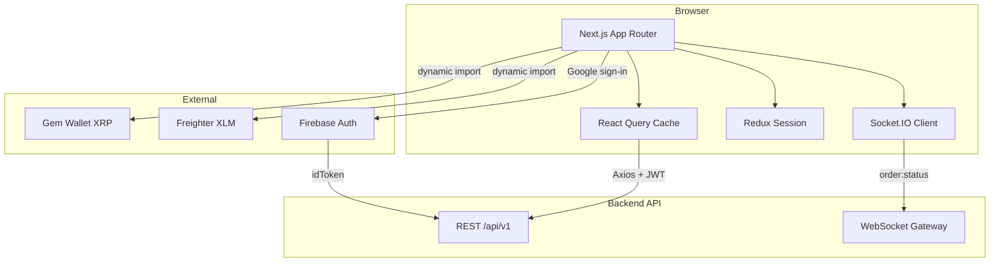
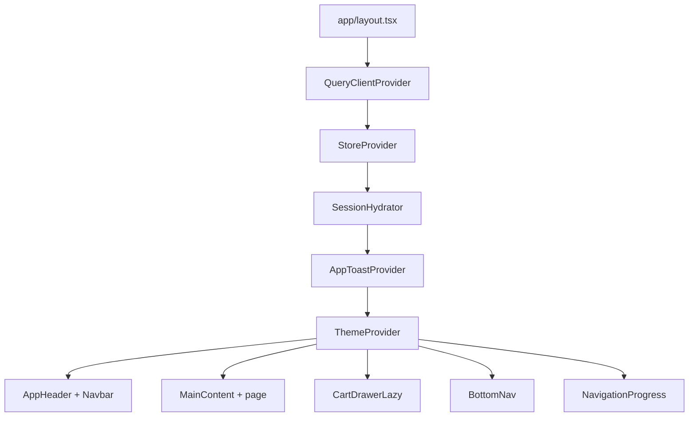
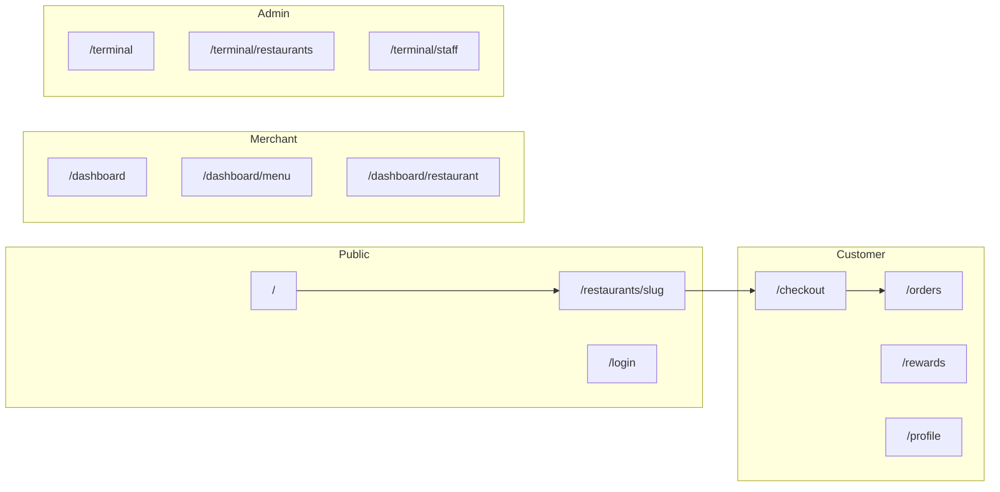
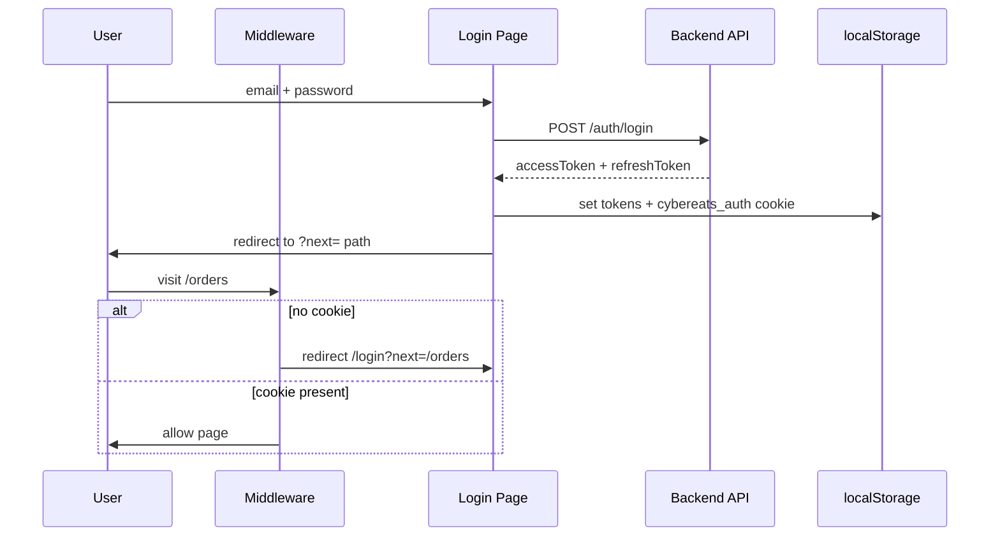
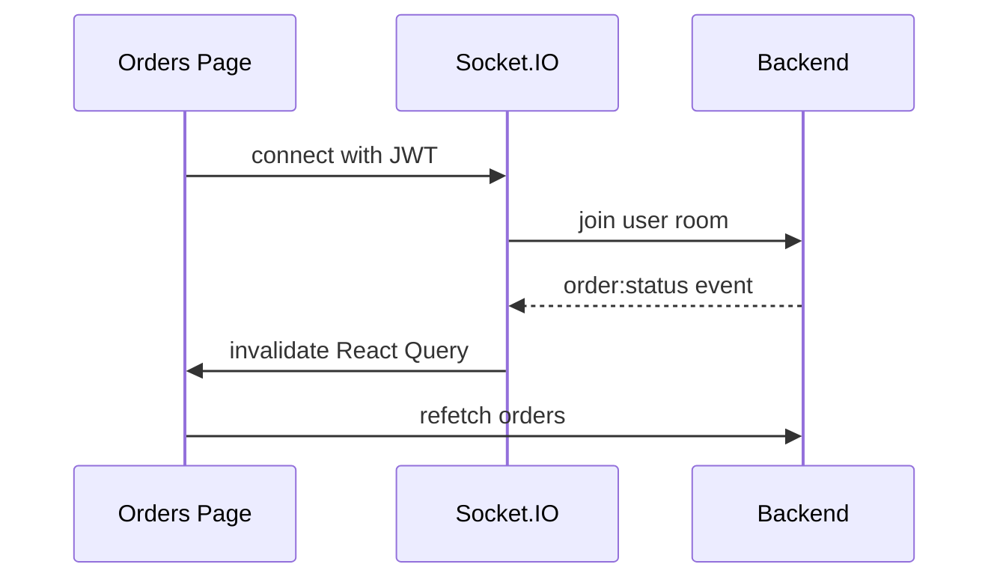
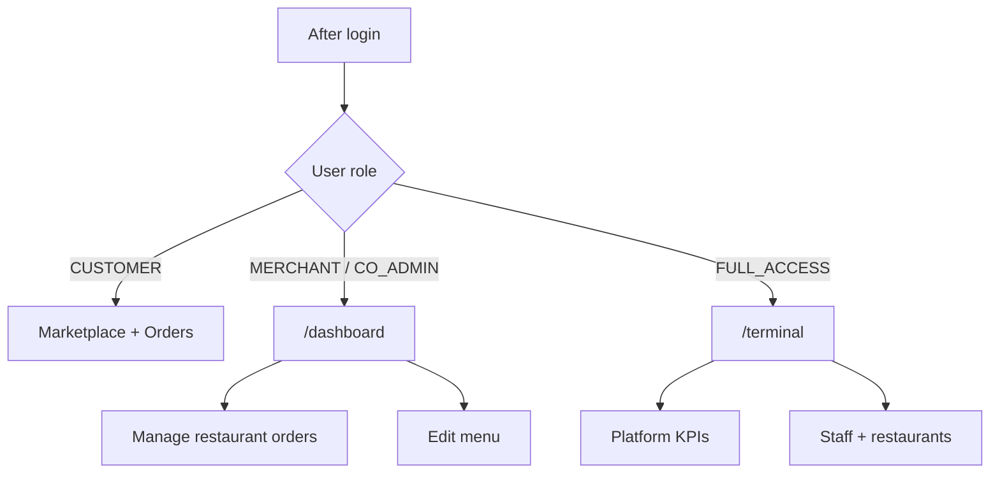
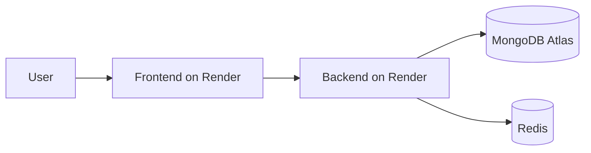
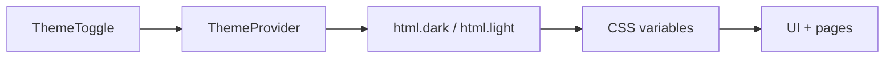

# CyberEats Client

Next.js 16 marketplace UI for **CyberEats** — cyberpunk food delivery with dual-crypto checkout (XRP via Gem, XLM via Freighter), real-time order tracking, admin analytics, and merchant operations.

**Live stack:** React 19 · App Router · Tailwind CSS v4 · TanStack Query · Redux Toolkit · Socket.IO

---

## Table of contents

- [Architecture](#architecture)
- [Route map](#route-map)
- [User flows](#user-flows)
- [Role-based access](#role-based-access)
- [Project structure](#project-structure)
- [Getting started](#getting-started)
- [Environment variables](#environment-variables)
- [Scripts](#scripts)
- [Deployment (Render)](#deployment-render)
- [Testing](#testing)
- [Theme system](#theme-system)

---

## Architecture

High-level view of how the client talks to the API and external services.



### Provider & layout stack



---

## Route map

| Route | Access | Description |
|-------|--------|-------------|
| `/` | Public | Marketplace home — browse restaurants, search, categories |
| `/restaurants/[slug]` | Public | Restaurant detail + menu, add to cart |
| `/login` · `/signup` | Public | Secure Terminal auth |
| `/checkout` | Auth | Delivery address, place order, wallet payment |
| `/orders` | Auth | Order history list |
| `/orders/[id]` | Auth | Live order timeline |
| `/rewards` | Auth | Credits, perks, staking |
| `/profile` | Auth | Account, 2FA, wallet link, theme |
| `/dashboard` | Merchant | Merchant orders (WebSocket) |
| `/dashboard/menu` | Merchant | Manage menu items |
| `/dashboard/restaurant` | Merchant | Edit restaurant info |
| `/terminal` | Admin | Analytics overview + charts |
| `/terminal/restaurants` | Admin | CRUD restaurants, assign merchants |
| `/terminal/staff` | Admin | Invite staff, roles |
| `/terminal/ledger` | Admin | Payment ledger |
| `/terminal/logistics` | Admin | Drone fleet status |



---

## User flows

### Authentication



Supported login methods:
- Email / password (+ optional 2FA)
- OAuth (Google, Facebook, Discord, Telegram) via backend redirects
- Firebase Google popup (`SocialLoginButtons`)
- Wallet signature link (profile)

### Browse → Cart → Checkout

```mermaid
flowchart TD
  A[Marketplace Home] --> B[Restaurant Page]
  B --> C{Logged in?}
  C -->|No| D[Redirect /login]
  C -->|Yes| E[Add to cart]
  E --> F[Cart badge in Navbar]
  F --> G[/checkout]
  G --> H[Place order]
  H --> I[Wallet pay or Mock]
  I --> J{Payment verified?}
  J -->|Yes| K[/orders/id tracking]
  J -->|No| L[Error toast]
```

**Payment wallets**
| Wallet | Chain | Asset |
|--------|-------|-------|
| Gem | XRPL testnet | XRP |
| Freighter | Stellar testnet | XLM |

Wallet SDKs are **lazy-loaded** on pay click to keep initial bundle small.

### Real-time order updates



Polling was removed on orders/merchant panels in favor of WebSocket events.

---

## Role-based access



| Role | Dashboard | Permissions |
|------|-----------|-------------|
| `CUSTOMER` | — | Browse, order, rewards |
| `MERCHANT` | `/dashboard` | Own restaurant orders & menu |
| `CO_ADMIN` | `/dashboard` | Merchant ops (not full admin) |
| `FULL_ACCESS` | `/terminal` | Platform admin + analytics |

`RequireAuth` + middleware cookie (`cybereats_auth`) guard protected routes.

---

## Project structure

```
frontend/
├── app/                      # Next.js App Router pages
│   ├── (auth)/               # login, signup, oauth callback
│   ├── (admin)/terminal/     # admin dashboard routes
│   ├── (merchant)/dashboard/ # merchant hub routes
│   ├── checkout/
│   ├── orders/
│   ├── restaurants/[slug]/
│   ├── layout.tsx            # root providers + shell
│   ├── template.tsx          # route transition fade
│   └── loading.tsx           # global loading UI
├── components/
│   ├── layout/               # PageShell, AppHeader, DashboardShell
│   ├── ui/                   # button, card, input, dialog, toast
│   ├── CartNavButton.tsx
│   ├── NavigationProgress.tsx
│   └── ThemeToggle.tsx
├── features/
│   ├── admin/                # charts, KPIs, staff, ledger
│   ├── auth/                 # forms, OAuth, 2FA
│   ├── cart/                 # useCart, CartDrawer
│   ├── checkout/             # WalletPayButton, payment overlay
│   ├── marketplace/          # home, menu cards, search
│   └── merchant/             # orders panel, menu editor
├── hooks/                    # useWebSocket, useHealth, useMounted
├── lib/                      # wallets, payments, server-api, auth
├── providers/                # Query, Redux, Theme, Toast, Session
├── services/api.ts           # Axios client + token refresh
└── styles/globals.css        # design tokens (dark + light)
```

---

## Getting started

### Prerequisites

- **Node.js 20+**
- **Backend API** running (default `http://localhost:4000`)
- MongoDB + Redis (via backend / docker-compose at repo root)

### Install & run

```bash
cd frontend
npm install
```

Create `.env.local`:

```env
NEXT_PUBLIC_API_URL=http://localhost:4000/api/v1
```

```bash
npm run dev
```

Open **http://localhost:3000**

### Seed test users (backend)

From the backend folder (requires seeded DB):

```bash
cd ../backend
npm run seed
```

| Account | Password | Route |
|---------|----------|-------|
| `customer@test.com` | `Test@1234` | `/` |
| `merchant@test.com` | `Test@1234` | `/dashboard` |
| `admin@test.com` | `Test@1234` | `/terminal` |

---

## Environment variables

| Variable | Required | Description |
|----------|----------|-------------|
| `NEXT_PUBLIC_API_URL` | Yes | Backend API base, e.g. `http://localhost:4000/api/v1` |
| `NEXT_PUBLIC_FIREBASE_API_KEY` | No | Firebase Google sign-in |
| `NEXT_PUBLIC_FIREBASE_AUTH_DOMAIN` | No | Firebase auth domain |
| `NEXT_PUBLIC_FIREBASE_PROJECT_ID` | No | Firebase project ID |
| `NEXT_PUBLIC_FIREBASE_APP_ID` | No | Firebase app ID |
| `NEXT_PUBLIC_FIREBASE_MESSAGING_SENDER_ID` | No | Firebase sender ID |
| `NEXT_PUBLIC_TELEGRAM_BOT_USERNAME` | No | Telegram OAuth widget |

> `NEXT_PUBLIC_*` vars are baked in at **build time**. Change them → rebuild/redeploy.

---

## Scripts

| Command | Description |
|---------|-------------|
| `npm run dev` | Dev server (webpack) |
| `npm run dev:turbo` | Dev server (Turbopack) |
| `npm run build` | Production build |
| `npm start` | Run production server |
| `npm run analyze` | Bundle analyzer (`ANALYZE=true`) |
| `npm run lint` | ESLint |
| `npm run test:e2e` | Playwright E2E tests |

---

## Deployment (Render)

This repo can be deployed as a **standalone Web Service** (see [CyberEats_client](https://github.com/AtulPandey429/CyberEats_client)).

| Setting | Value |
|---------|--------|
| **Build Command** | `npm install && npm run build` |
| **Start Command** | `npm start` |
| **Node version** | 20+ |

**Environment (production):**

```env
NODE_ENV=production
NEXT_PUBLIC_API_URL=https://your-api.onrender.com/api/v1
```

Backend must set `FRONTEND_URL` to your Render frontend URL for CORS.



---

## Testing

```bash
# E2E (requires dev server + backend)
npm run test:e2e
```

E2E specs cover browse, auth, checkout, merchant, admin, and theme toggle (`tests/e2e/`).

---

## Theme system

Dual **dark / light** mode via CSS variables in `styles/globals.css`.



- Toggle in **navbar** and **profile**
- `ThemeScript` prevents flash of wrong theme on load
- Semantic utilities: `.text-accent`, `.text-muted`, `.border-theme`, `.app-background`

---

## Performance notes

- **SSR** initial data on home + restaurant pages (`lib/server-api.ts`)
- **Lazy load** Recharts (admin) and wallet SDKs (checkout)
- **Route prefetch** on main nav links
- **WebSocket** instead of polling for order status
- **Conditional cart fetch** — only on marketplace-related routes

---

## Related repos

| Repo | Purpose |
|------|---------|
| [CyberEats](https://github.com/AtulPandey429/CyberEats) | Full monorepo (backend + frontend) |
| [CyberEats_client](https://github.com/AtulPandey429/CyberEats_client) | Frontend-only deploy target |

---

## License

Private — CyberEats project.
